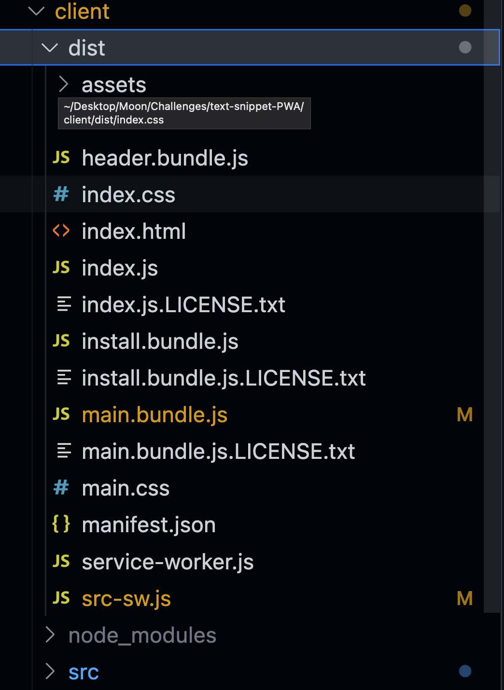

[](http://creativecommons.org/publicdomain/zero/1.0/)

# Text Snippet

[GitHub Repository](https://github.com/Truecoding4life/text-snippet-PWA)

[Deployed Link](https://boiling-lowlands-40577-2b4b9eb554b0.herokuapp.com/)

[Jay's Studio](https://truecoding4life.github.io/Jaystudio/)

#### Table of contents
* [Description](#description)
* [Installation](#installation)
* [Features](#features)
* [Technologies used](#technologies-used)
* [Credit](#credit)


#### Description
This is a robust text editor built as a Progressive Web Application (PWA) that empowers developers to create and manage notes or code snippets seamlessly, whether online or offline. This project, part of a comprehensive course, showcases advanced concepts, including data persistence with IndexedDB, webpack bundling, and service worker integration using workbox.


#### Installation
1. Open the application in your browser.
2. Enter content in the text editor.
3. Click off the DOM window for automatic content saving.
4. Close and reopen the text editor to verify content retrieval from IndexedDB.
5. Click the "Install" button to download the application as an icon on your desktop.

**Get ready to elevate your coding experience with this advanced PWA text editor!**

## Features

**Webpack**

Using Webpack I can bundle all require module into one directory 

```
const { InjectManifest } = require("workbox-webpack-plugin");
module.exports = () => {
  return {
    mode: "development",
    entry: {
      main: "./src/js/index.js",
      install: "./src/js/install.js",
    },
    output: {
      filename: "[name].bundle.js",
      path: path.resolve(__dirname, "dist"),
    },
    plugins: [
      new MiniCssExtractPlugin(),
      new HtmlWebpackPlugin({
        template: "./index.html",
        title: "J.A.T.E",
      }),
      new InjectManifest({
        swSrc: "./src-sw.js",
        swDest: "src-sw.js",
      }),
      new WebpackPwaManifest({
        fingerprints: false,
        inject: true,
        name: "Just Another Text Editor",
        short_name: "J.A.T.E",
        description: "Takes notes with JavaScript syntax highlighting!",
        background_color: "#225CA3",
        theme_color: "#225CA3",
        start_url: "/",
        publicPath: "/",
        icons: [
          {
            src: path.resolve("./src/images/logo.png"),
            sizes: [96, 128, 192, 256, 384, 512],
            destination: path.join("assets", "icons"),
          },
        ],
      }),
    ],
    module: {
      rules: [
        {
          test: /\.css$/i,
          use: [MiniCssExtractPlugin.loader, "css-loader"],
        },
        {
          test: /\.m?js$/,
          exclude: /node_modules/,
          use: {
            loader: "babel-loader",
            options: {
              presets: ["@babel/preset-env"],
              plugins: [
                "@babel/plugin-proposal-object-rest-spread",
                "@babel/transform-runtime",
              ],
            },
          },
        },
      ],
    },
  };
};

```

Here is our dist directory generated by webpack with all requires CSS and JS modules.



**Service Worker**

Implemented service worker to help with caching data to optimize usage
```
registerRoute(({ request }) => request.mode === "navigate", pageCache);
// Set up asset cache
registerRoute(
  ({ request }) => ["style", "script", "worker", "image"].includes(request.destination),
  new StaleWhileRevalidate({
    cacheName: "asset-cache",
    plugins: [
      new CacheableResponsePlugin({
        statuses: [0, 200],
      }),
    ],
  })
);

```


## Technologies used


### Credit